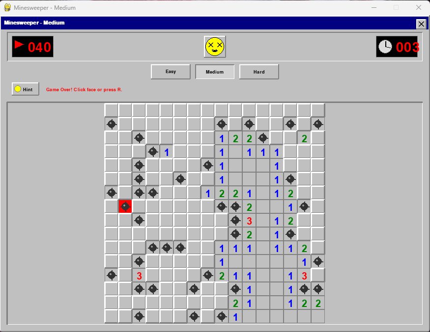

# Minesweeper (Retro Clone)

[](https://www.python.org/)
[](https://opensource.org/licenses/MIT) 
*(Consider adding a license file like MIT if you wish)*

A classic Minesweeper game clone featuring a nostalgic Windows 9x/2000 aesthetic, built with Python and Pygame. Test your logic and deduction skills by clearing the board without detonating any hidden mines!



## Description

This project faithfully recreates the beloved Minesweeper experience, complete with the iconic grey interface, beveled elements, digital counters, and the expressive smiley face reacting to your progress. It includes modern quality-of-life features alongside the core gameplay, providing a challenging and enjoyable retro experience.

## Features

*   **Authentic Minesweeper Gameplay:** The classic rules and objectives you know and love.
*   **Retro Windows 9x/2000 Visual Style:** Faithfully recreated interface elements for maximum nostalgia.
*   **Multiple Difficulty Levels:**
    *   **Easy:** 9x9 grid, 10 mines
    *   **Medium:** 16x16 grid, 40 mines
    *   **Hard:** 30x16 grid, 99 mines
*   **Difficulty Selection Buttons:** Easily switch between difficulties using dedicated UI buttons.
*   **Mine Counter & Timer:** Track remaining mines (total mines - flags) and elapsed game time.
*   **Interactive Smiley Face:** Changes expression based on game state (start, playing, win, lost).
*   **Chording (Middle-Click / L+R Click):** Quickly clear safe neighbors around a revealed number if the correct number of flags are placed nearby.
*   **Flagging & Question Marks:** Right-click to cycle through Flag -> Question Mark -> Clear on unrevealed cells.
*   **Hint Button:** Reveals a single, guaranteed safe square (unrevealed, unflagged).
*   **Sound Effects:** Includes sounds for starting, clicking/revealing, winning, and hitting a mine.
*   **Local High Scores:** Automatically saves the top 5 fastest times for each difficulty level in `minesweeper_scores.json`.
*   **First Click Safety:** Your first click on the grid is guaranteed *not* to be a mine.

## How to Play

1.  Choose a difficulty using the "Easy", "Medium", or "Hard" buttons, or start with the default (Easy).
2.  Click any square on the grid to begin the game and start the timer. The first click is always safe.
3.  A revealed square showing a number indicates how many mines are in the 8 adjacent squares.
4.  If a revealed square is blank, it means there are zero adjacent mines, and all adjacent safe squares will be automatically revealed (flood fill).
5.  Use the number clues to logically deduce the locations of the hidden mines.
6.  **Right-click** on a square you suspect contains a mine to place a **flag**. The mine counter will decrease.
7.  **Right-click** on a flagged square to turn it into a **question mark** (useful for uncertain squares). The mine counter will revert.
8.  **Right-click** on a question mark square to clear the mark.
9.  The objective is to reveal all squares that **do not** contain mines.
10. Clicking on a square with a mine results in **Game Over**.
11. Revealing all safe squares results in a **Win**. Your time will be recorded if it's a high score for that difficulty.

## Controls

*   `Left Click`: Reveal a square.
*   `Right Click`: Cycle: **Flag** -> **Question Mark** -> **Clear Mark** (on unrevealed squares).
*   `Middle Click` (or `Left + Right Click` simultaneously) on a **revealed number**: Perform **Chord** action.
*   `Click Face Button`: Reset the game with the **current** difficulty.
*   `Click Hint Button`: Reveal one safe, unrevealed square.
*   `Click Difficulty Button` ("Easy", "Medium", "Hard"): Start a new game on that difficulty.
*   `R` Key: Reset the game with the **current** difficulty.
*   `F2` Key: Start new **Easy** game.
*   `F3` Key: Start new **Medium** game.
*   `F4` Key: Start new **Hard** game.
*   `F5` Key: Print current high scores to the console.

## Requirements

*   **Python 3:** (Tested with 3.10+, compatible with most Python 3 versions)
*   **Pygame:** The core library used for graphics and sound.

## Installation

1.  Ensure Python 3 is installed on your system.
2.  Install the Pygame library via pip:
    ```bash
    pip install pygame
    ```
3.  Clone or download this repository:
    ```bash
    git clone https://github.com/AlfaExelsior/minesweeper.git 
    cd minesweeper 
    ```
    

## Running the Game

1.  Navigate to the project directory in your terminal or command prompt.
2.  Make sure you have the required sound files (see below) placed in a subfolder named `sounds`.
3.  Execute the main Python script:
    ```bash
    python minesweeper.py
    ```
    

## Required Sound Files

For the sound effects to work, place the following files (in `.wav` format) inside a folder named `sounds` located in the same directory as the script:

*   `click.wav`
*   `lose_minesweeper.wav`
*   `start.wav`
*   `win.wav`

The game will print warnings if files are missing but will attempt to run without the corresponding sounds.

## High Score File

The game automatically creates and manages a file named `minesweeper_scores.json` in the same directory as the script. This file stores the top 5 best times (in seconds) for each difficulty level. You can view the scores by pressing `F5` while the game is running (output appears in the console).

## Author

*   **AlfaExelsior**
*   GitHub: [https://github.com/AlfaExelsior](https://github.com/AlfaExelsior)

---

Have fun sweeping!
